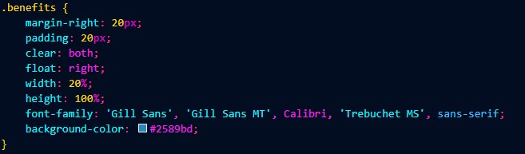
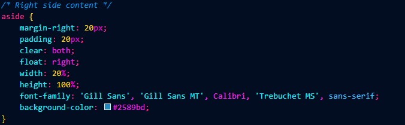
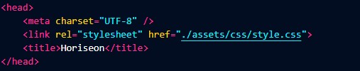
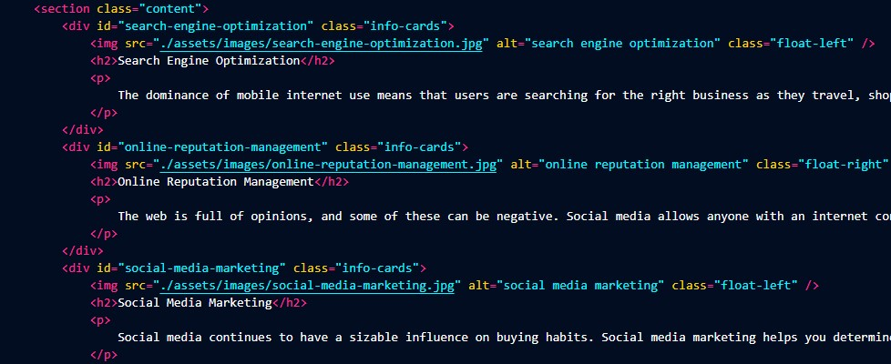

# 01-Module-Challenge
Homework for Week 1: Module 01: HTML, CSS, and Git
___
## SEO Optimized Application
### [Horiseon](https://josejpd3.github.io/01-Module-Challenge/#social-media-marketing) has been optimized for higher ranking in search engines.

___

 **Changes :**

+ Added accesible alt attribute
+ Added concise and descriptive title
+ Updated semantic HTML elements
+ Ensured to maintain a proper semantic struture
+ Added descriptive comments
+ Reworked CSS for efficiency and maintainability
___

## Semantic Elements and Comments
**Before :**

**After :**

___

## Concise and Descriptive Title
Added `<title>Horiseon</title>` in order to quickly inform about the content in the page.

___

## Alternative Text Attributes
Added `alt=""` attributes to make it more accesible and to obtain a greater SEO.

